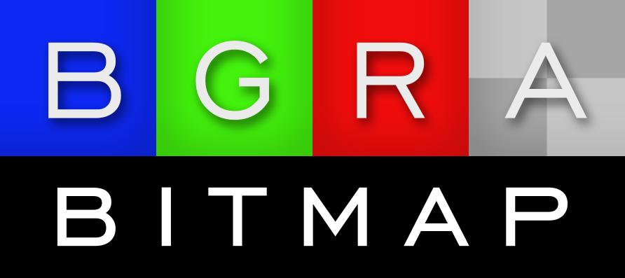

List of directories:
- bglcontrols: controls providing OpenGL surface with BGRABitmap
- bgrabitmap: contains BGRABitmap library
- dev: tools used to make BGRABitmap
- doc: scripts to generate html documentation (uses [pasdoc](https://github.com/circular17/pasdoc) and [graphviz](https://graphviz.org/))
- libwebp: contains the Dll of LibWebP for Windows
- test: contains a series of test programs and examples on how to use BGRABitmap library
- winmake: contains batch files for make under Windows

Files:
- commit.sh: script to commit change from Linux terminal
- Makefile: generate the code and compile. On Windows, you need to make sure that make.exe from FPC and lazutils.exe from Lazarus tools are in the PATH.
- update_BGRABitmap.json: package information for OPM in Lazarus

Useful binaries for Windows:
- [WEBP Dlls](https://github.com/bgrabitmap/bgrabitmap/tree/master/libwebp)
- [AVIF Dlls](https://github.com/bgrabitmap/bgrabitmap/files/12566323/libavif_windows_dlls_ver_1_0_1-1.zip)

